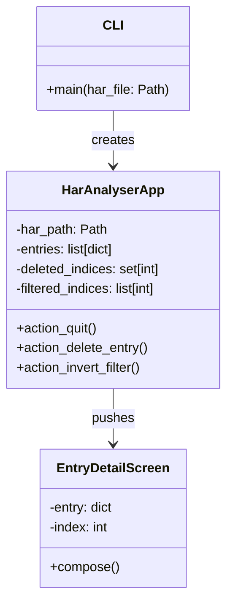
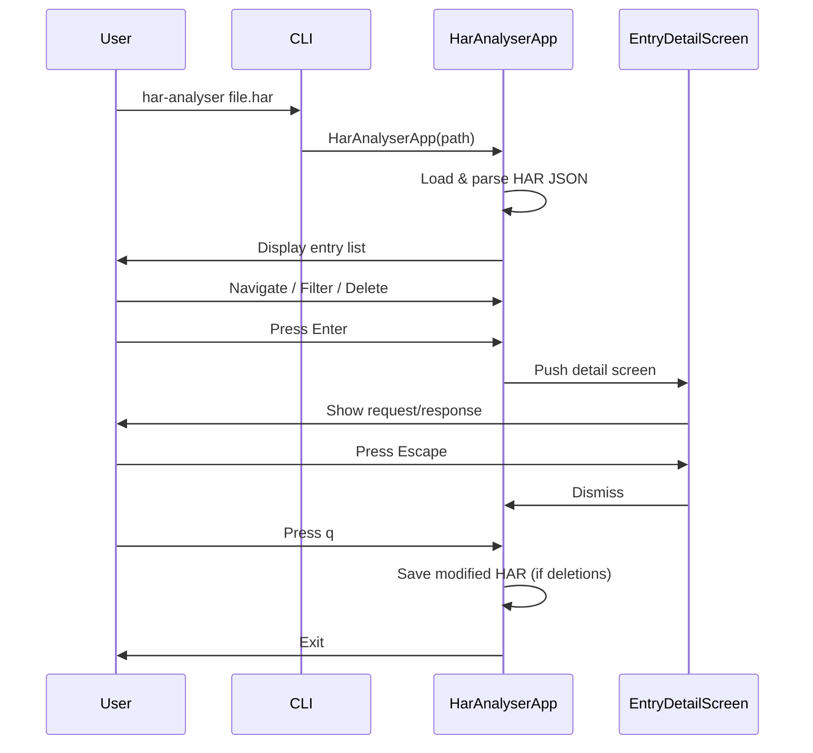

# HAR Analyser

A terminal-based interactive viewer for HAR (HTTP Archive) files. Quickly inspect HTTP transactions captured by browser dev tools with color-coded methods, status codes, session tracking, and filtering.

## Features

- Color-coded entry list by HTTP method (GET, POST, PUT, DELETE, PATCH) and status code class (2xx-5xx)
- Detail view showing full request/response headers, cookies, body content, and timing breakdown
- Session view that groups and colors entries by session cookie values
- Filter entries by HTTP method, domain, path, or session ID
- Invert filters to show excluded entries
- Delete entries and save the modified HAR file on exit

## Architecture





## Usage

```bash
har-analyser <path-to-file.har>
```

### Keybindings

| Key | Action |
|-----|--------|
| `Enter` | View entry details |
| `Escape` / `q` | Back / Quit |
| `s` | Toggle session view |
| `f` | Toggle filter mode / Clear filter |
| `m` | Filter by method (in filter mode) |
| `d` | Filter by domain (in filter mode) |
| `p` | Filter by path (in filter mode) |
| `i` | Filter by session (in filter mode) |
| `v` | Invert current filter |
| `Backspace` / `Delete` | Delete highlighted entry |

## Getting Started

### Prerequisites

- Python >= 3.10

### Installation

```bash
git clone git@github.com:max-rousseau/har-analyser.git
cd har-analyser
python -m venv .venv
source .venv/bin/activate
pip install -e .
```

Then run against any `.har` file exported from browser dev tools:

```bash
har-analyser captured-traffic.har
```
