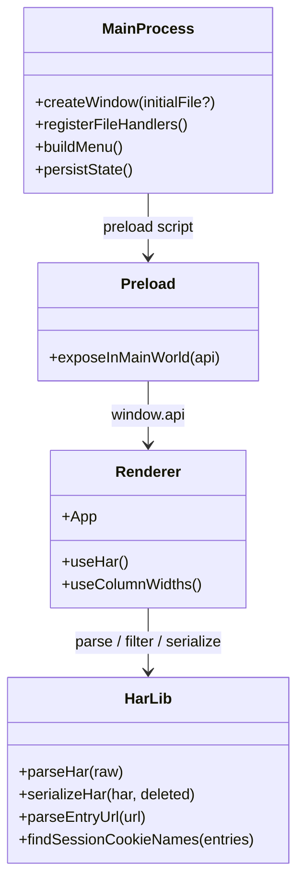
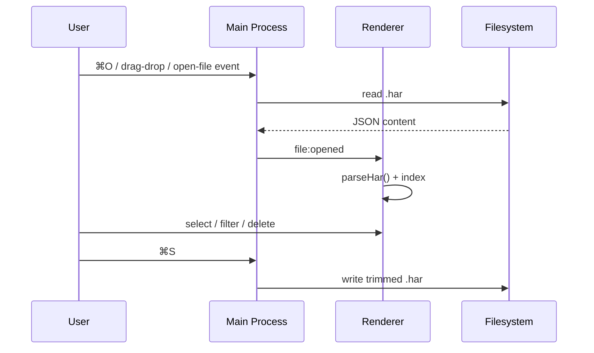

# HAR Analyser

A focused, native-feel HAR (HTTP Archive) inspector for macOS. Open a `.har` capture from browser dev tools, scan its HTTP transactions, build filters by click, drop noisy entries, and save the trimmed file back.

## Features

- Open `.har` / `.json` archives — `⌘O`, drag-drop, or double-click in Finder (file association)
- Master / detail layout with a **resizable** divider that hides automatically when nothing is selected
- Multi-select packets — click, `⇧↑/↓` to range-select, `⌘A` selects every visible row
- Color-coded list by HTTP method (GET / POST / PUT / PATCH / DELETE), status class (2xx / 3xx / 4xx / 5xx), and request time (green / yellow / red against RAIL latency thresholds)
- **Filter Mode** (`F`) — pause/resume the active filter chips without losing them
- **Add Filter** (`A`) — one-shot: arm, click any cell in the list to filter by that value; auto-disarms after one add
- Double-click any filter chip value to edit it inline; click `=` / `≠` to invert; click `×` to remove
- Free-text **search** (`⌘F`) across method, status, and URL — runs independently of filter mode
- **Session View** (`S`) — auto-detects session cookies in the capture and shades each row by session, with a coloured stripe on the left edge
- Right-click the column header for a column menu — toggle visibility, double-click a name to set an alias, reset all
- Right-click any packet row for a context menu — **Copy this packet** (writes the HAR entry JSON to the clipboard), **Delete entry**
- Resizable columns with drag handles; widths and aliases persist
- Detail panel with **Headers**, **Cookies**, **Request Body**, **Response Body**, **Timings** tabs; collapsible sections; pretty-printed JSON bodies; per-cookie cards with name=value coloring and chip pills for `domain` / `path` / `expires` / `HttpOnly` / `Secure`
- Delete entries non-destructively (`Backspace` / `Delete`), with a clickable "N deleted" pill in the status bar to restore them. **Save** (`⌘S`) overwrites the file with deletions applied; **Save As…** (`⇧⌘S`) exports a trimmed copy
- Multi-window (`⌘N`); unsaved-deletions prompt on close
- Reopens documents that were open the last time you quit
- Light, Dark, and System appearance, plus six theme packs: **Plain**, **Forest**, **Midnight**, **Solar Flare**, **Cherry**, **Terminal** (`⌘T` cycles)
- Native macOS chrome with traffic lights, File menu, Open Recent, Edit / View / Window menus

## Architecture


```mermaid
classDiagram
    class MainProcess {
        +createWindow(initialFile?)
        +registerFileHandlers()
        +buildMenu()
        +persistState()
    }
    class Preload {
        +exposeInMainWorld(api)
    }
    class Renderer {
        +App
        +useHar()
        +useColumnWidths()
    }
    class HarLib {
        +parseHar(raw)
        +serializeHar(har, deleted)
        +parseEntryUrl(url)
        +findSessionCookieNames(entries)
    }
    MainProcess --> Preload : preload script
    Preload --> Renderer : window.api
    Renderer --> HarLib : parse / filter / serialize
```


```mermaid
sequenceDiagram
    participant User
    participant Main as Main Process
    participant Renderer
    participant FS as Filesystem

    User->>Main: ⌘O / drag-drop / open-file event
    Main->>FS: read .har
    FS-->>Main: JSON content
    Main->>Renderer: file:opened
    Renderer->>Renderer: parseHar() + index
    User->>Renderer: select / filter / delete
    User->>Main: ⌘S
    Main->>FS: write trimmed .har
```

## Keybindings

| Key                  | Action                                                     |
| -------------------- | ---------------------------------------------------------- |
| `⌘N`                 | New window                                                 |
| `⌘O`                 | Open…                                                      |
| `⌘S` / `⇧⌘S`         | Save / Save As…                                            |
| `⌘W` / `⌘Q`          | Close window / Quit                                        |
| `⌘F`                 | Focus search                                               |
| `⌘A`                 | Select all visible packets (works from anywhere)           |
| `⌘T`                 | Cycle theme pack                                           |
| `F`                  | Toggle Filter Mode (pause/resume chip filters)             |
| `A`                  | Arm Add-Filter Mode (one-shot — next column click filters) |
| `S`                  | Toggle Session View                                        |
| `↑` / `↓`            | Navigate the entry list                                    |
| `Backspace` / `Del`  | Soft-delete the selected packet(s)                         |
| `Escape`             | Clear selection; if nothing selected, clear filters/search |

Filters are kept across the `F` toggle so you can blink the unfiltered view on and off.

## Getting Started

### Prerequisites

- macOS 12+ (Apple Silicon)
- Node.js 20+

### Install from a release

Download the latest `.dmg` from the [Releases](../../releases) page, open it, and drag **HAR Analyser** into Applications.

### Build from source

```bash
git clone git@github.com:max-rousseau/har-analyser.git
cd har-analyser
npm install
npm run dev               # development with hot reload
npm run package:mac:dev   # unsigned local .dmg (Apple Silicon)
```

See [CONTRIBUTING.md](./CONTRIBUTING.md) for the full dev workflow and release process.
